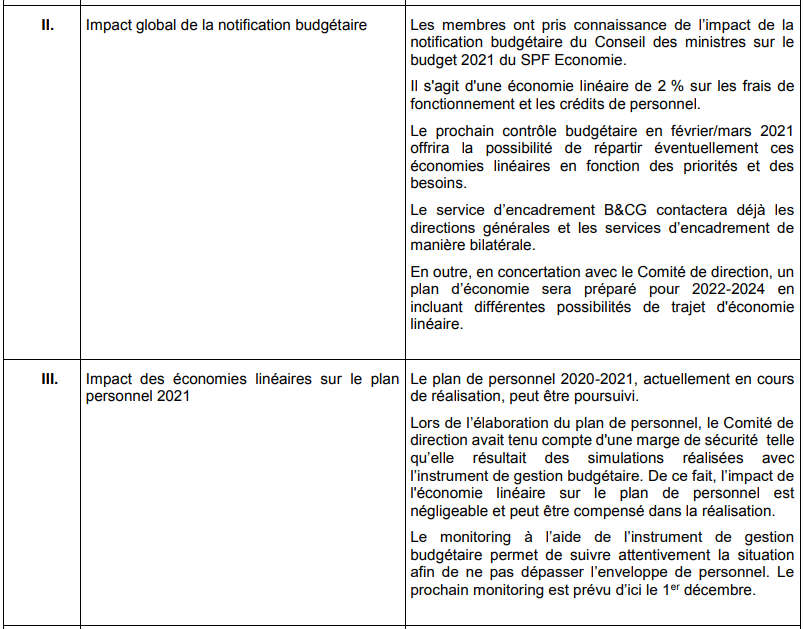

<link rel="stylesheet" href="kult.css">
<link rel="stylesheet" href="table2.css">

# Note de politique (Fonction Publique) 2020

* 04.11.2020 - [Note de Politique](55K1580008.pdf) (doc. parl. 55K1580008)
* 18.11.2020 - [demande de contributions](20201118_NPG_Fx-Publique_Demande_commentaires.md) du Président du Comité Commun

## &#10047; Objectifs déclarés

* page 3/30

> L’objectif principal des fonctionnaires fédéraux est d’offrir des services de qualité à tous les citoyens.  
> (...)  
> Les politiques doivent également veiller à ce que les services publics soient en mesure d’effectuer correctement leur travail.  
> (...)

| &nbsp; | &agrave; retenir |
| --- | --- |
| obligation des fonctionnaires | offrir des services de qualité aux citoyens |
| obligation des politiques | que les services publics puissent travailler dans de bonnes conditions |

* pages 3/30 et 4/30

> En 2021, je tiens, en collaboration avec nos fonctionnaires, à me concentrer sur la simplification et la numérisation  
> (...)   
> Dans le domaine de la politique du personnel également, l’accent est mis sur le travail faisable et les organisations agiles.  
> (...)  
>  Les réalisations seront en tout cas toujours le fruit d’un travail de groupe. Je m’efforcerai d’établir une bonne collaboration avec les fonctionnaires dirigeants et les organisations syndicales.

| &nbsp; | &agrave; retenir |
| --- | --- |
| leviers prioritaires pour la Ministre | &#9312; simplification &#9313; numérisation &#9314; travail faisable &#10502; &middot;1&middot; &#9315; concertation syndicale |

<u>Commentaires :</u>  

&#10503; &middot;1&middot; Comme on le constatera à la lecture des instruments ci-dessous, le **travail** sera surtout _**rendu faisable**_ pour le comité de direction :
* autonomie accrue pour le comité de direction
* flexibilité demandée aux fonctionnaires (télétravail, gains de m2, gains d'efficacité, synergies, ...)

## &#10047; Instruments mentionnés par la Ministre

| &nbsp; | &agrave; retenir |
| :--- | --- |
| &#9312; simplification | &#10041; only once (via "*cartographie des services physiques attendus que l’on devra fournir aux citoyens*") (4/30) révision de la loi sur les marchés publics (4/30 et 5/30) |
| &#9313; numérisation | &#10041; chatbots (4/30) &#10041; eBox (4/30) &#10041; open data (comptabilité, budget, RH) (5/30)</li></ul> |
| &#9314; travail faisable | &#10041; autonomisation Managers révision contrat d'administration (5/30) &#10502; &middot;2&middot; &#10041; plans de personnels plus qualitatifs (5/30) &#10502; &middot;3&middot; &#10041;  réduction des mètres carrés de surface de bureau grâce au télétravail (5/30 et 9/30) &#10041; Federal Innovation Awards annuels (5/30) &#10502; &middot;4&middot; &#10041; répertoire des compétences numériques des fonctionnaires (8/30) &#10502; &middot;5&middot; |
| &#9315; concertation syndicale | &#10041; statut du lanceur d'alerte (Dir. CE/2019/1937) (6/30) &#10041; flou et interprétation *a contrario* possible &#10503; OK avec les inquiétudes exprimées dans la [lettre de la CGSP](Lettre_CGSP_20201110.pdf) |

<u>Commentaires :</u>  

&#10503; &middot;2&middot; Le collège des présidents a été chargé de revoir la structure des contrats d'administration de la façon suivante :

* l'objectif est d'aboutir à la formule de contrat d'administration `TO BE` pour novembre 2021 ;
* il s'agirait d'un document qui comporterait un volet stratégique, qui serait valable pour toute la législature, en ligne avec l'accord de gouvernement et les priorités des ministres de tutelle ;
* à côté de ce volet stratégique figurerait un volet opérationnel, qui serait quant à lui adaptable chaque année ;
* un troisième volet contiendrait, comme par le passé, les objectifs opérationnels transversaux (consensus assez large à propos de ce qui a été proposé par le SPF BOSA) 

&#10503; &middot;3&middot; <u>Citation:</u> "*Les plans de personnel seront transformés en un instrument plus qualitatif axé sur les compétences sans perdre l’approche de suivi budgétaire.*"

* Pour ce qui est du SPF &Eacute;conomie, un nouvel Inspecteur des Finances arrivera au 01.01.2021, avec un risque de possibilités moindres de recrutement.
* le comité de direction `ADM` du 18.11.2020 a voulu prendre ses précautions de la manière suivante :

&#10503; &middot;4&middot; <u>Citation:</u> "*La meilleure source d’idées susceptibles de renforcer le service vient souvent des fonctionnaires eux-mêmes. La capacité d’innovation de l’Administration est dès lors
encouragée. Par analogie avec le “Federal Diversity Award”, un “Federal Innovation Award” annuel sera créé et attribué au projet ayant le plus grand impact sur
les services fournis par l’Administration. Une attention particulière sera accordée aux projets qui peuvent également être adoptés comme meilleures pratiques dans d’autres institutions publiques.*"

On est est ainsi à mille lieues du travail faisable profitable aux travailleurs :
* non seulement, on réintroduit la notion de stakhanoviste, d'employé du mois, ... ;
* mais aussi, on vise à étendre par contagion à tous les SPF les idées les plus innovantes (ou absurdes, ou aberrantes) qui auraient été testées (<u>sans concertation syndicale</u> préalable)
* rappelons que le signalement des maladies et l'envoi de médecins-contrôleurs n'était à l'origine qu'un projet testé dans deux SPF à peine, avant d'être imposé par ... Circulaire

&#10503; &middot;5&middot; <u>Citation:</u> "*Un outil sera élaboré pour répertorier les compétences
numériques des fonctionnaires afin de pouvoir investir dans le développement des compétences numériques nécessaires pour l’avenir.*"

Risque de tri et de coupes sombres dans les effectifs :
* ne seront plus recrutés, encouragés, formés, récompensés que ceux dont les compétences numériques seront <u>nécessaires pour l'avenir</u> ... difficile d'être plus clair ;
* que deviennent les autres ?
    * voir à ce propos la fin de la page 8/30 à propos de l'encouragement de la mobilité : "*Une attention particulière sera accordée à la réorientation des fonctionnaires <u>dont les postes disparaissent ou dont les compétences ne correspondent plus</u> à leur service actuel*"

