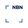

<link rel="stylesheet" href="kult.css">
<link rel="stylesheet" href="table2.css">

&nbsp;

# Secteur IV / Sector IV

* [SPF &Eacute;conomie](https://economie.fgov.be/fr), P.M.E., Classes moyennes et &Eacute;nergie [FOD Economie](https://economie.fgov.be/nl),
K.M.O., Middenstand en Energie
    *  
* [SPP Politique scientifique](https://www.belspo.be/belspo/index_fr.stm) [POD Wetenschapsbeleid](https://www.belspo.be/belspo/index_nl.stm)
    * 
* Bureau fédéral du [Plan](https://www.plan.be/index.php?lang=fr) Federaal [Planbureau](https://www.plan.be/index.php?lang=nl)
    * 
* [Banc d'épreuve](https://www.bancdepreuves.be/fr/banc-d--039-epreuves-des-armes-a-feu) des armes à feu [Proefbank](https://www.bancdepreuves.be/nl/proefbank-voor-vuurwapens) voor Vuurwapens
* Conseil central de l'Economie Centrale Raad voor het Bedrijfsleven
    *  - [CCE](https://www.ccecrb.fgov.be/c/fr/22/presentation) / [CRB](https://www.ccecrb.fgov.be/c/nl/22/voorstelling)
* Organisme national des Déchets radioactifs et des Matières fissiles enrichies  Nationale Instelling voor Radioactief Afval en Verrijkte Splijtstoffen
    *  - [ONDRAF](https://www.ondraf.be/) - [NIRAS](https://www.niras.be/)
* Commission de Régulation de l'&Eacute;lectricité et du Gaz  Commissie voor de Regulering van de Elektriciteit en het Gas
    * [https://www.creg.be/fr](https://www.creg.be/fr) / [https://www.creg.be/nl](https://www.creg.be/nl)
    * 
* Conseil supérieur des Indépendants et des Petites et Moyennes Entreprises Hoge Raad voor de Zelfstandigen en de Kleine en Middelgrote Ondernemingen
    * [CSIPME](https://www.csipme.fgov.be/) / [HRZKMO](https://www.hrzkmo.fgov.be/)
* [Bureau de Normalisation](https://www.nbn.be/fr) [Bureau voor Normalisatie](https://www.nbn.be/nl)
    * 
* APETRA
    * [https://www.apetra.be/fr](https://www.apetra.be/fr) / [https://www.apetra.be/nl](https://www.apetra.be/nl)
    * 
* Service de médiation pour l'énergie  Ombudsdienst voor energie
    * [https://www.mediateurenergie.be/fr](https://www.mediateurenergie.be/fr) / [https://www.ombudsmanenergie.be/nl](https://www.ombudsmanenergie.be/nl)
    * 
* [Autorité belge de la Concurrence](https://www.abc-bma.be/fr) [Belgische Mededingingsautoriteit](https://www.abc-bma.be/nl)
    * 

## Tous les Secteurs / Alle Sectoren

| &nbsp; | &nbsp; | &nbsp; |
| :--- | :---: | :--- |
| I. | Administration générale | Algemeen bestuur |
| II. | Finances | Financiën |
| III. | Justice | Justitie |
| IV. | Affaires économiques | Economische zaken |
| V. | Intérieur | Binnenlandse Zaken |
| VI. | Mobilité et Transports | Mobiliteit en Vervoer |
| VII. | Affaires étrangères | Buitenlandse Zaken |
| VIII. | Services postaux et Télécommunications | Postdiensten en telecommunicatie |
| IX. | Enseignement Communauté française | &nbsp; |
| X. | &nbsp; | Enseignement Onderwijs van de Vlaamse Gemeenschap |
| XI. | Emploi et Travail | Werkgelegenheid en Arbeid |
| XII. | Santé publique | Volksgezondheid |
| XIII. | Sécurité sociale | Sociale Zekerheid |
| XIV. | Défense | Landsverdediging |
| XV. | Région de Bruxelles-Capitale | Brussels Hoofdstedelijk Gewest |
| XVI. | Région wallonne | &nbsp; |
| XVII. | Communauté Wallone-Bruxelles | &nbsp; | 
| XVIII. | &nbsp; | Vlaamse Gemeenschap en Vlaams Gewest |
| XIX. | Communauté germanophone / Deutschsprachige Gemeinschaft | Duitstalige Gemeenschap / Deutschsprachige Gemeinschaft |
| XX. | Institutions Publiques de Sécurité Sociale | Openbare Instellingen van Sociale Zekerheid |