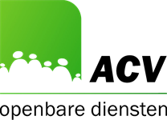

<link rel="stylesheet" href="kult.css">
<link rel="stylesheet" href="table2.css">

# Secteur IV - Sector IV

### Permalink : [https://newdevprojects.github.io/ACV-CSC/]()

&nbsp;

 

## Réunions / Vergaderingen

| &nbsp; | &nbsp; | &nbsp; |
| :--- | :---: | :--- |
| Hilde |  | [afscheid](afscheid.pdf)  |
| Comité commun / Groepscomité | [13.02.2020](20200213.md) | [PV (projet)](20200213_PV_CCommun_REV2.docx)  |
| CIC 12.02.2020 / TOC 12.02.2020 | [projet de PV](CIC_20200212.pdf)  | [ontwerp notulen](TOC_20200212.pdf)  |
| CIC 12.06.2020 / TOC 12.06.2020 | [projet de PV](CIC_20200612.pdf)  | [ontwerp notulen](TOC_20200612.pdf)  |
| CIC 30.07.2020 / TOC 30.07.2020 | [projet de PV](CIC_20200730.pdf)  | [ontwerp notulen](TOC_20200730.pdf)  |
| CCB2 30.10.2020 / BOC2 30.10.2020 | [projet de PV](CCB2_20201030.pdf)  | [ontwerp notulen](BOC2_20201030.pdf)  |
| Note de politique / Beleidsnota | [e-mail 18.11.2020](20201118_NPG_Fx-Publique_Demande_commentaires.md) | [input R. Dumoulin](NPG_NotesRD.md) | 

## Thèmes / Thema's

| &nbsp; | &nbsp; | &nbsp; |
| :--- | :--- | :--- |
| Statut syndical / Syndicaal statuut | Loi/Wet [12.19.1974](L_19741219.pdf)  | AR/KB [28.09.1984](AR19840928.pdf)  | 
| Formation / Opleiding | [Catalogue 2021](Formations_2021.pdf)  | 17.11.2020 | 

